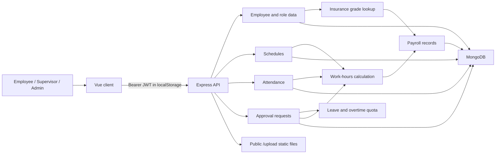
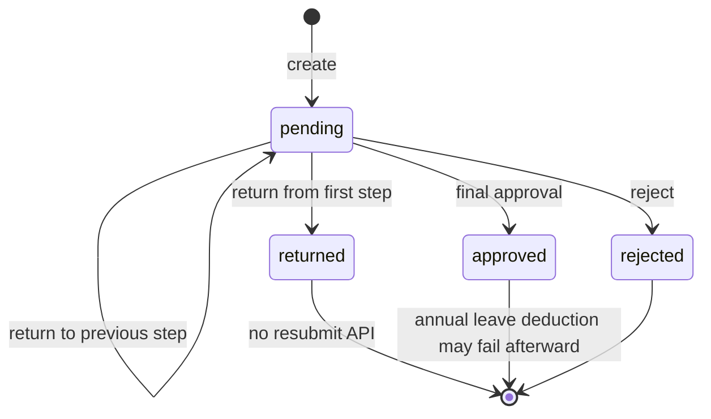

# 台灣 HR 系統稽核管理摘要

稽核日期：2026-07-28
稽核基準：`codex/schedule-rules-validation` 工作樹，HEAD `0cdf93fa6061e389f341cbb283e646aced7b414f`
比較基準：`main` 與目前 HEAD 相同；本分支功能全部位於未提交工作樹（10 個已追蹤修改、3 個新檔）
稽核原則：僅檢查，不修改正式 VM、正式 MongoDB、API 或 Schema

## 結論

目前版本**不建議直接上線或合併**。稽核實際重現 3 項 P0：一般員工可冒用主管完成簽核、可替任意員工寫入打卡，主管可刪除不屬於自己的班表。另有完整員工個資／薪資／銀行資料越權讀取、附件公開與同源腳本風險、薪資與保險法規計算錯誤等 P1。

新增的排班規則方向正確，但把公司內規與法定最低標準寫在同一組常數中，未支援二／四／八週變形工時、54 小時／三個月 138 小時加班例外、輪班 8 小時例外，也以班別名稱中的「例／休」判斷法律性質。這會同時誤擋合法班表，也可能因改名而繞過規則。

| 嚴重度 | 數量 | 上線要求 |
| --- | ---: | --- |
| P0 | 3 | 合併或部署前必須修正 |
| P1 | 10 | 必須修正，或由負責人與台灣勞務／法務書面接受風險 |
| P2 | 7 | 排入近期版本並補回歸測試 |
| P3 | 3 | 納入工程與維運改善 |

## 已確認的 P0

1. `POST /api/approvals/:id/act` 信任 body 的 `employee_id`。隔離動態測試中，employee Token 傳入 supervisor ID，回傳 `200`，簽核變為 `approved`，日誌也被記成主管本人。
2. `POST /api/attendance` 信任 body 的 `employee`。隔離動態測試中，一般員工替 admin 寫入 `outing`，回傳 `201` 並確實落庫。
3. `DELETE /api/schedules/:id` 只檢查角色，不檢查班表所有權。隔離動態測試中，主管刪除非其部屬班表，回傳 `200` 且資料消失。

## 系統資料流

目前缺少一致的服務層交易邊界。簽核狀態、特休扣減、薪資計算與附件保存分散在控制器及個別服務中；失敗時沒有同一交易或補償紀錄。

## 驗證結果

| 項目 | 結果 |
| --- | --- |
| 後端完整測試 | 63 suites：48 pass、15 fail；349 tests：298 pass、51 fail |
| 前端完整測試 | 43 files：33 pass、10 fail；271 tests：222 pass、49 fail |
| 新規則聚焦測試 | `laborRuleValidationService`、`approvalWorkflow` 通過；`schedule.unit` 2 項失敗 |
| 後端覆蓋率 | Statements 59.83%、Branches 44.68%、Functions 66.54%、Lines 62.41%；覆蓋率執行本身未全綠 |
| 前端覆蓋率 | 未安裝 `@vitest/coverage-v8` 或 Istanbul provider，無法產生 |
| 前端 production build | 成功；主 bundle 約 1,017 KB，`xlsx` chunk 約 430 KB |
| 隔離三角色 API 測試 | 401 邊界正常；5 項物件授權／完整性漏洞成功重現 |
| 隔離效能測試 | 3,000 員工、90,000 班表、12,000 簽核；代表查詢 14.46-51.99 ms |
| 依賴掃描 | 後端 8 High + 6 Moderate；前端 4 High，`xlsx` 無 npm 修補版本 |
| 秘密掃描 | 未確認追蹤中的正式密鑰；命中均為文件範例或測試值 |

## 正式站與 VM

- `220.130.79.215:3000` 可達，`/api/health` 五次約 143-148 ms。
- 未登入 `/api/employees` 正確回 `401`；惡意 Origin 未取得 `Access-Control-Allow-Origin`。
- 回應缺少 CSP、HSTS、`X-Content-Type-Options` 等標頭，並暴露 `X-Powered-By: Express`。
- `192.168.1.99:22` 逾時；兩個已知公開 IP 的 SSH 22 埠也未開放。因此 PM2、MongoDB systemd/config、資料目錄、磁碟、備份與復原狀態均是**未驗證**，不是通過。
- 工作區沒有找到 `.bson`、Mongo archive、`.gz` 或 `.zip` 備份，無法完成隔離還原驗收。

## 法規基準

工程評估使用稽核日官方有效資料：

- [勞動基準法](https://law.moj.gov.tw/LawClass/LawAll.aspx?pcode=N0030001)，修正日期 2024-07-31。
- [勞工請假規則](https://law.moj.gov.tw/LawClass/LawAll.aspx?pcode=N0030006)，修正日期 2025-12-09，2026 年適用。
- [性別平等工作法](https://law.moj.gov.tw/LawClass/LawAll.aspx?pcode=N0030014)。
- [個人資料保護法](https://law.moj.gov.tw/LawClass/LawAll.aspx?pcode=I0050021) 2025 年修法部分尚未生效，現行義務須依有效舊法條文判斷。
- [勞動部 2026 最低工資](https://www.mol.gov.tw/1607/28162/28166/28180/70460/76761/76833/post)：月薪 29,500 元、時薪 196 元。
- [勞保局 2026 投保薪資分級表](https://www.bli.gov.tw/0100493.html)與[健保署 2026 投保金額資料](https://info.nhi.gov.tw/IODE0000/IODE0000S09?id=285)。

本報告屬工程合規評估，不取代台灣律師、勞務顧問或主管機關意見。公司採用的變形工時、特殊職類、例假調整及較嚴格內規，正式上線前必須由適格人員確認。
